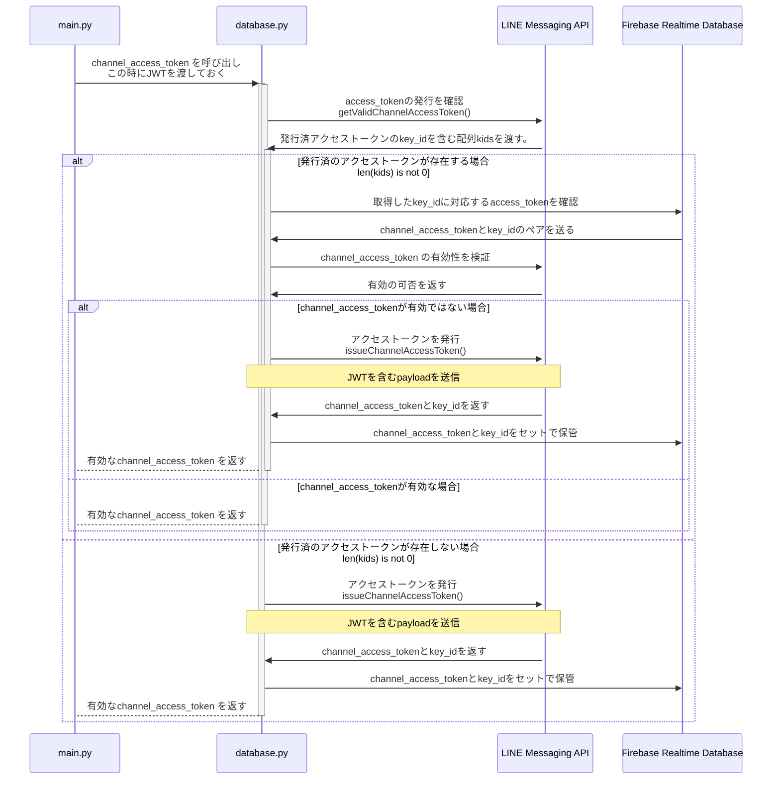

# 認証について

LINE Messaging API の仕様に合わせて、JWTで発行したchannel_access_tokenを利用してAPInに対する認証を行なっています。

## channel_access_token の取得について

```mermaid
  sequenceDiagram
  
    main.py->>+database.py: channel_access_token を呼び出し<br>この時にJWTを渡しておく
    activate database.py
    database.py->>+LINE Messaging API: access_tokenの発行を確認<br>getValidChannelAccessToken() 
    LINE Messaging API->>+database.py: 発行済アクセストークンのkey_idを含む配列kidsを渡す。
    alt 発行済のアクセストークンが存在する場合<br>len(kids) is not 0
      database.py->>Firebase Realtime Database: 取得したkey_idに対応するaccess_tokenを確認
      Firebase Realtime Database->>database.py: channel_access_tokenとkey_idのペアを送る
      database.py->>LINE Messaging API: channel_access_token の有効性を検証
      LINE Messaging API->>database.py: 有効の可否を返す
      alt channel_access_tokenが有効ではない場合
        database.py->>LINE Messaging API: アクセストークンを発行 <br>issueChannelAccessToken()
        note over database.py,LINE Messaging API: JWTを含むpayloadを送信
        LINE Messaging API->>database.py: channel_access_tokenとkey_idを返す
        database.py->>Firebase Realtime Database: channel_access_tokenとkey_idをセットで保管
        database.py-->main.py: 有効なchannel_access_token を返す
        deactivate database.py
      else channel_access_tokenが有効な場合
        database.py-->main.py: 有効なchannel_access_token を返す
        deactivate database.py
      end
    else 発行済のアクセストークンが存在しない場合<br>len(kids) is not 0
      database.py->>LINE Messaging API: アクセストークンを発行 <br>issueChannelAccessToken()
      note over database.py,LINE Messaging API: JWTを含むpayloadを送信
      LINE Messaging API->>database.py: channel_access_tokenとkey_idを返す
      database.py->>Firebase Realtime Database: channel_access_tokenとkey_idをセットで保管
      database.py-->main.py: 有効なchannel_access_token を返す
      deactivate database.py
    end

```
